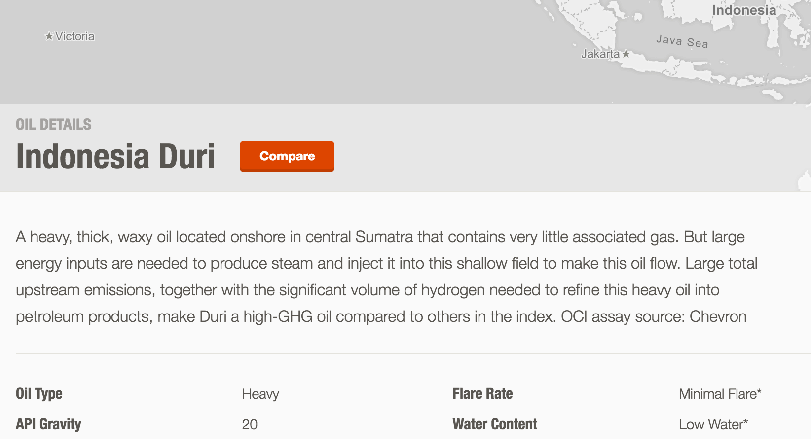
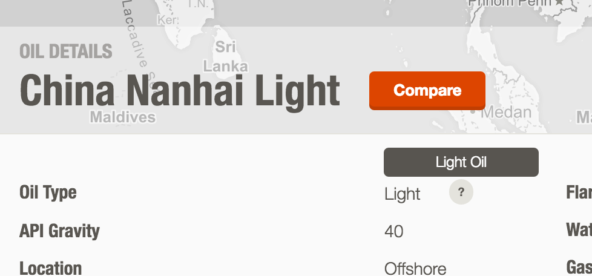

## Static Content

Carnegie can update any static copy throughout the site by changing the html/[ejs](http://www.embeddedjs.com/) in the [template files](https://github.com/carnegieendowment/oil-climate-index-2/tree/master/app/assets/scripts/templates) (some of the file names don't exactly match the view name for legacy reasons):

#### Views:
- [Home](https://github.com/carnegieendowment/oil-climate-index-2/tree/master/app/assets/scripts/templates/homepage.ejs)
- [About](https://github.com/carnegieendowment/oil-climate-index-2/tree/master/app/assets/scripts/templates/about.ejs)
- [Team](https://github.com/carnegieendowment/oil-climate-index-2/tree/master/app/assets/scripts/templates/team.ejs)
- [Models](https://github.com/carnegieendowment/oil-climate-index-2/tree/master/app/assets/scripts/templates/models.ejs)
- [Methodology](https://github.com/carnegieendowment/oil-climate-index-2/tree/master/app/assets/scripts/templates/methodology.ejs)
- [Glossary](https://github.com/carnegieendowment/oil-climate-index-2/tree/master/app/assets/scripts/templates/glossary.ejs)
- [Map](https://github.com/carnegieendowment/oil-climate-index-2/tree/master/app/assets/scripts/templates/mapview.ejs)
- [Total Emissions](https://github.com/carnegieendowment/oil-climate-index-2/tree/master/app/assets/scripts/templates/supplycurve.ejs)
- [Supply Chain](https://github.com/carnegieendowment/oil-climate-index-2/tree/master/app/assets/scripts/templates/compareoils.ejs)
- [Analysis](https://github.com/carnegieendowment/oil-climate-index-2/tree/master/app/assets/scripts/templates/emissionsdrivers.ejs)
- [Oil Details](https://github.com/carnegieendowment/oil-climate-index-2/tree/master/app/assets/scripts/templates/oildetails.ejs)
- [Compare View](https://github.com/carnegieendowment/oil-climate-index-2/tree/master/app/assets/scripts/templates/compareview.ejs)

#### Partial Templates (included on multiple pages):
- [Index (Header + Search + Footer)](https://github.com/carnegieendowment/oil-climate-index-2/blob/master/app/index.html)
- [Blue Footer](https://github.com/carnegieendowment/oil-climate-index-2/tree/master/app/assets/scripts/templates/bluebar.ejs)
- [Sliders](https://github.com/carnegieendowment/oil-climate-index-2/tree/master/app/assets/scripts/templates/modelparameters.ejs)
- [Price Modal](https://github.com/carnegieendowment/oil-climate-index-2/tree/master/app/assets/scripts/templates/prices.ejs)
- [404](https://github.com/carnegieendowment/oil-climate-index-2/blob/master/app/404.html)

#### Notes

- HTML elements on the Glossary and Methodology pages can be given an `id` (rather than the traditional `name` attribute) and they will be directly linkable with the pattern, `../#glossary/[id]` (e.g. `../#glossary/combustion`)
- Small tooltips can be edited by changing the `data-title-after` or `data-title-before` attributes. Please refraining from adding these attributes to other elements as it can have unintended styling effects.

## Dynamic Content

Outside of information generated from the OCI Consolidated Workbook, there are three other places which allow for easily updated, dynamically generated content:

#### Blurbs

Each oil details page can contain a longer, prose description of the oil.

These are editable from [blurbs.json](https://github.com/carnegieendowment/oil-climate-index-2/blob/master/app/assets/data/blurbs.json) where each JSON key is the Unique Oil Name (from the OCI Consolidated Workbook) and contains a property `description` where the oil description can be entered.

#### Related Oils

Each oil details view and compare view will show up 5 related oils at the bottom of the page and as suggestions in the "compare" button. These are editable from [related.json](https://github.com/carnegieendowment/oil-climate-index-2/blob/master/app/assets/data/related.json) in a similar way to the blurbs: each JSON key is the Unique Oil Name and the values are arrays of 5 other Unique Oil Names.

This same file will also accept keys which match the Oil Type Names and the `description` will appear on hover as shown:

#### Prices

The default prices and display names for the products on the Price Modal can be edited from [prices.json](https://github.com/carnegieendowment/oil-climate-index-2/blob/master/app/assets/data/prices.json). Each JSON key is an internal variable (shouldn't be changed) with two properties:
- `name`: the display name of that product
- `price`: the default price of that product
